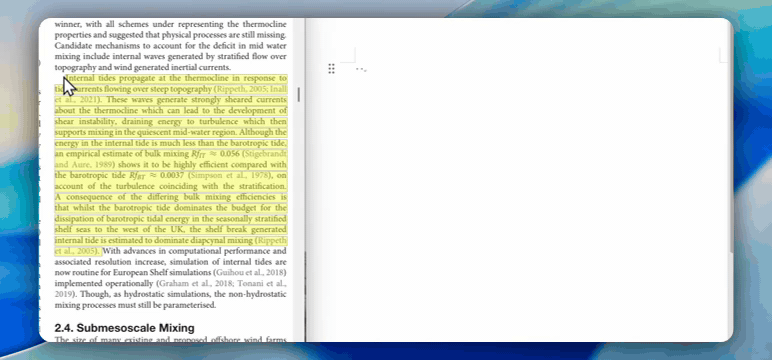
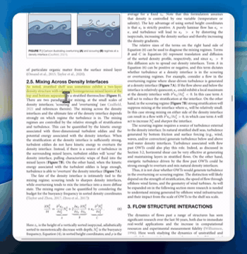
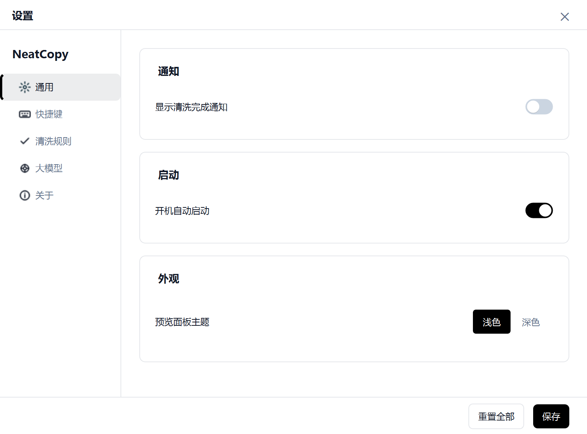
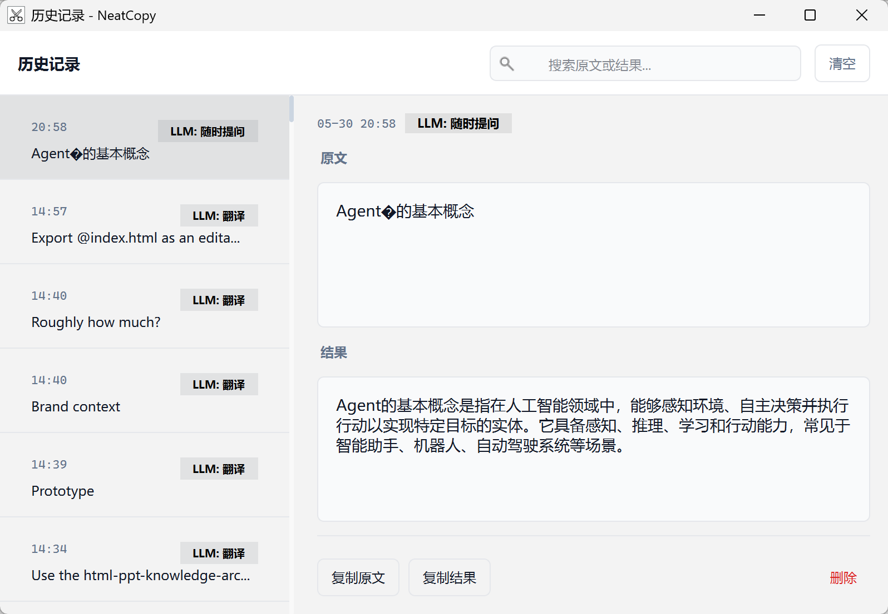
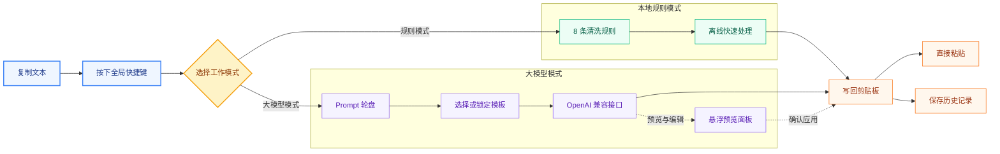

<div align="center">


**让复制粘贴更干净，也让 AI 能力触手可及**

[](https://github.com/StoneLL1/NeatCopy/releases/latest)
[](https://github.com/StoneLL1/NeatCopy/releases/latest)
[](https://www.python.org/)
[](https://github.com/StoneLL1/NeatCopy/stargazers)

NeatCopy 是一款常驻 Windows 系统托盘或 macOS 菜单栏的剪贴板文本处理工具。复制文本后按下全局快捷键，
即可通过本地规则或大模型完成清洗、翻译、润色与摘要。

查看官网：https://stonell1.github.io/neatcopy-website/

[下载安装](https://github.com/StoneLL1/NeatCopy/releases/latest) ·
[功能概览](#-功能概览) ·
[使用指南](#-使用指南) ·
[开发说明](#-开发说明)

</div>


---

## 为什么需要 NeatCopy？

从 PDF、论文、网页或聊天窗口复制文字时，经常会遇到多余换行、混乱空格和中英文标点不统一的问题：

```text
处理前：
随着人工智能技术的不断发
展，大语言模型在自然语言处
理领域取得了重大突破。

按下处理快捷键后：
随着人工智能技术的不断发展，大语言模型在自然语言处理领域取得了重大突破。
```

中英文混排也可以一键整理：

```text
处理前：NeatCopy是一款桌面工具,支持LLM模式
处理后：NeatCopy 是一款桌面工具，支持 LLM 模式
```

NeatCopy 让这类重复操作变成一个简单流程：

```text
复制文本 -> 按下快捷键 -> 直接粘贴
```

<div align="center">
  
</div>

## 🤖 大模型特色

NeatCopy 不只是文本清洗工具。接入 OpenAI 兼容接口后，可以把常用 AI 操作放进复制粘贴流程中，
无需频繁切换网页或对话窗口。

例如，将一段中文翻译为英文：

```text
复制中文 -> 按处理快捷键 -> 在轮盘中选择「翻译」
         -> 预览面板查看结果 -> 确认后直接粘贴
```

<div align="center">
  
</div>

### Prompt 轮盘：在鼠标旁快速选择任务

按下快捷键后，扇形轮盘会在鼠标位置弹出。你可以用鼠标或数字键 `1-5` 选择 Prompt：

| Prompt 示例 | 用途 |
| --- | --- |
| 翻译 | 自动识别中英文并翻译 |
| 格式清洗 | 借助大模型整理复杂段落 |
| 文字润色 | 将口语化表达改写得更自然、专业 |
| 内容摘要 | 从长文本中提炼重点 |
| 随时提问 | 将剪贴板内容作为问题快速获取回答 |

常用 Prompt 也可以通过轮盘快捷键（Windows 默认 `Ctrl+Shift+P`，macOS 默认 `⌘⇧P`）锁定。锁定后，后续处理会直接使用该模板。

### 预览面板：应用前先看一眼

按预览快捷键（Windows/macOS 默认均为 `Control+Q`）打开悬浮预览面板。大模型返回结果后，可以先检查和编辑内容，再应用到剪贴板。
即使预览面板未打开，结果也会正常写入剪贴板，保持快速粘贴体验。

### 自定义 Prompt：把 AI 变成顺手的小工具

Prompt 模板支持自由编辑。除了翻译和润色，还可以用于会议记录整理、Markdown 格式转换、
术语解释、代码注释翻译等场景。

## ✨ 功能概览

### 大模型模式

接入 OpenAI 兼容接口后，可将一次复制粘贴变成轻量 AI 工作流：

- 自定义 Prompt 模板，用于翻译、润色、摘要、格式转换等场景
- 支持 OpenAI、DeepSeek、Moonshot、本地 Ollama 等兼容接口
- 使用 Prompt 轮盘快速选择或锁定常用模板
- 在悬浮预览面板中查看并编辑处理结果
- 请求失败时保留原始剪贴板内容，避免误覆盖

### 本地规则模式

无需联网，也不需要 API Key。内置 8 条按顺序执行的文本清洗规则：

| 规则 | 作用 |
| --- | --- |
| 合并软换行 | 合并 PDF、CAJ 等来源的段落内断行 |
| 保留段落分隔 | 保留真正的空行和段落结构 |
| 合并多余空格 | 将连续空格整理为单个空格 |
| 智能全角 / 半角标点 | 根据中英文语境调整标点 |
| 中英文间距 | 自动补齐 Pangu 风格间距 |
| 清理行首尾空白 | 移除每行两侧的多余空白 |
| 保护代码块 | 跳过 Markdown 代码块，不破坏代码格式 |
| 保护列表结构 | 保留有序列表与无序列表的换行 |

### 桌面体验

| 功能 | 说明 |
| --- | --- |
| 全局快捷键 | Windows 默认 `Ctrl+Shift+C`；macOS 默认 `⌘⇧C` |
| 双击复制触发 | 可选开启双击 `Ctrl+C` / `⌘C` 自动清洗 |
| Prompt 轮盘 | 在鼠标位置弹出扇形菜单，支持数字键 `1-5` |
| 历史记录 | 自动保存处理记录，支持搜索、复制、删除和清空 |
| 托盘 / 菜单栏 | Windows 常驻系统托盘，macOS 常驻菜单栏，不占用任务栏或 Dock 空间 |
| 状态提示 | 托盘或菜单栏图标及通知显示处理中、成功或失败状态 |
| 开机启动 | 可在设置中开启系统自动启动 |

## 🚀 快速开始

### 下载安装

前往 [Releases](https://github.com/StoneLL1/NeatCopy/releases/latest) 下载最新版本：

| 版本 | 适用场景 |
| --- | --- |
| `NeatCopy_Setup_v*.exe` | 推荐。通过安装向导安装，可创建开始菜单和桌面快捷方式 |
| `NeatCopy.exe` | 便携版。无需安装，下载后直接运行 |
| `NeatCopy-*-macOS-arm64.dmg` | Apple Silicon 版本。打开后将 NeatCopy 拖入 Applications |

macOS 的轮盘、预览和历史记录快捷键无需隐私权限。“处理剪贴板”需要在“系统设置 → 隐私与安全性 → 辅助功能”中允许 NeatCopy，以向前台应用发送 `⌘C`；可选的双击 `⌘C` 功能需要单独开启“输入监控”，以只读方式识别两次复制。完整说明见 [macOS 使用指南](docs/macos.md)。

当前安装包尚未完成平台代码签名。Windows 首次运行时可能显示 SmartScreen 提示；macOS 可能显示 Gatekeeper 提示。请仅从本仓库 Releases 下载，具体处理方式见下方[常见问题](#-常见问题)。

### 三步使用

1. 选中文字，按 `Ctrl+C`（Windows）或 `⌘C`（macOS）复制。
2. 按 `Ctrl+Shift+C`（Windows）或 `⌘⇧C`（macOS）处理剪贴板。
3. 按 `Ctrl+V`（Windows）或 `⌘V`（macOS）粘贴整理后的内容。

点击 Windows 托盘或 macOS 菜单栏图标即可打开设置。在「清洗规则」页面中可切换规则模式或大模型模式。

<div align="center">
  
</div>

## 📖 使用指南

### 快捷键

| Windows 默认 | macOS 默认 | 功能 |
| --- | --- | --- |
| `Ctrl+Shift+C` | `⌘⇧C` | 处理剪贴板 |
| 双击 `Ctrl+C` | 双击 `⌘C` | 复制后自动处理（默认关闭） |
| `Ctrl+Shift+P` | `⌘⇧P` | 打开 Prompt 轮盘 |
| `Ctrl+Q` | `Control+Q` | 打开 / 关闭预览面板 |
| `Ctrl+H` | `Control+H` | 打开历史记录 |

### Prompt 轮盘

轮盘用于快速切换大模型模式下的 Prompt 模板：

- **随清洗触发**：按下清洗快捷键后先选择 Prompt，再执行处理。
- **锁定模式**：按轮盘快捷键（Windows `Ctrl+Shift+P` / macOS `⌘⇧P`）选择并锁定 Prompt，后续清洗直接使用该模板。
- **快捷选择**：鼠标点击或按数字键 `1-5` 选择，按 `Esc` 取消。

### 大模型配置

进入「设置 -> 大模型」，填写兼容服务提供方的连接信息：

| 字段 | 说明 | 示例 |
| --- | --- | --- |
| Base URL | OpenAI 兼容接口地址 | `https://api.openai.com/v1` |
| Model ID | 模型标识 | `gpt-4o-mini` |
| API Key | 服务提供方分配的密钥 | `sk-...` |
| Temperature | 输出随机性 | 默认 `0.2` |
| Timeout | 请求超时时间 | 默认 `30` 秒 |

> API Key 和设置仅保存在本机。Windows 路径为 `%APPDATA%\NeatCopy\config.json`，macOS 路径为 `~/Library/Application Support/NeatCopy/config.json`。本地 `localhost` / 回环地址的 OpenAI 兼容服务可不填 API Key。

### 历史记录

每次处理成功后，NeatCopy 会保存原文、结果、模式和时间戳。默认最多保留最近 `500` 条，可在设置中修改容量或关闭记录功能。

历史记录文件保存在当前用户的应用数据目录：

```text
Windows: %APPDATA%\NeatCopy\history.json
macOS:   ~/Library/Application Support/NeatCopy/history.json
```

<div align="center">
  
</div>

## 🧩 工作方式



## 🛠️ 开发说明

### 环境要求

- Windows 10 / 11，或 macOS 11+ Apple Silicon
- Python 3.11+

### 从源码运行

```bash
git clone https://github.com/StoneLL1/NeatCopy.git
cd NeatCopy

python -m venv .venv

# Windows PowerShell
.venv\Scripts\Activate.ps1

# macOS
source .venv/bin/activate

pip install -r requirements.txt

python src/main.py
```

### 测试与打包

```bash
# 运行自动化测试
python -m pytest tests -v

# Windows：生成 .exe
pyinstaller NeatCopy.spec

# macOS Apple Silicon：生成 .app 和 .dmg
installer/build_macos.sh
```

### 项目结构

```text
NeatCopy/
├── src/
│   ├── main.py                 # 应用入口与信号编排
│   ├── clip_processor.py       # 剪贴板处理调度
│   ├── rule_engine.py          # 本地规则引擎
│   ├── llm_client.py           # OpenAI 兼容接口客户端
│   ├── hotkey_manager.py       # 全局热键与键盘钩子
│   ├── macos_input.py          # macOS 原生热键、复制模拟与权限检测
│   ├── platform_defaults.py    # 平台快捷键默认值
│   ├── platform_paths.py       # 平台应用数据路径
│   ├── tray_manager.py         # Windows 托盘 / macOS 菜单栏与通知
│   ├── wheel_window.py         # Prompt 轮盘
│   ├── history_manager.py      # 历史记录管理
│   └── ui/                     # 设置、预览与历史记录窗口
├── assets/                     # 图标与资源文件
├── tests/                      # 自动化测试
├── docs/                       # 架构与开发文档
├── NeatCopy.spec               # Windows PyInstaller 配置
├── NeatCopy-macos.spec         # macOS PyInstaller 配置
└── installer/                  # Windows 安装脚本与 macOS DMG 构建脚本
```

更完整的技术细节见 [架构文档](docs/architecture.md)；macOS 权限和打包细节见 [macOS 使用指南](docs/macos.md)。

## 📝 更新日志

### v2.0.5

- 新增 macOS Apple Silicon 安装包，与 Windows 版本共享同一套核心功能
- 支持 macOS 原生全局快捷键、双击 `⌘C`、菜单栏常驻与 LaunchAgent 开机启动
- 修复 macOS 快捷键录制中 `Control` 与 `Command` 映射互换的问题

### v2.0.0

- 重构设置界面，统一视觉风格和交互细节
- 优化托盘菜单、Toast 提示和窗口表现
- 改进 Prompt 模板编辑与轮盘使用体验
- 修复轮盘绘制、动画和 QPainter 生命周期相关问题

### v1.9.x

- 新增历史记录窗口，支持搜索、复制、删除和容量控制
- 优化历史记录刷新和存储性能

### v1.8.0

- 新增 LLM 预览面板
- 支持自定义请求超时时长
- 重构 Prompt 轮盘选择器

完整版本记录请查看 [Releases](https://github.com/StoneLL1/NeatCopy/releases)。

## ❓ 常见问题

### 为什么首次运行会提示风险？

当前 Windows 与 macOS 发布包均尚未完成平台代码签名。Windows 遇到 SmartScreen 时可检查发布来源后选择「更多信息 → 仍要运行」；macOS 遇到 Gatekeeper 拦截时，可在“系统设置 → 隐私与安全性”中确认打开。建议仅从本仓库的 [Releases](https://github.com/StoneLL1/NeatCopy/releases/latest) 页面下载。

### 为什么快捷键没有响应？

请先确认 NeatCopy 正在 Windows 系统托盘或 macOS 菜单栏中运行，并检查快捷键是否被其他应用占用。Windows 可重新录制一个未冲突的组合；macOS 的普通面板快捷键无需隐私权限，但“处理剪贴板”需要“辅助功能”权限，双击 `⌘C` 需要“输入监控”权限。修改权限后建议退出并重新打开 NeatCopy。

### 大模型请求失败会覆盖剪贴板吗？

不会。只有请求成功后，NeatCopy 才会将结果写入剪贴板；失败时原始内容保持不变。

## 🤝 参与贡献

欢迎提交 [Issue](https://github.com/StoneLL1/NeatCopy/issues) 或 [Pull Request](https://github.com/StoneLL1/NeatCopy/pulls)：

1. Fork 本仓库并创建功能分支。
2. 完成功能开发与必要测试。
3. 使用清晰的提交信息描述改动。
4. 推送分支并创建 Pull Request。

---

<div align="center">

如果 NeatCopy 对你有帮助，欢迎点亮一个 [Star](https://github.com/StoneLL1/NeatCopy)。

Made with care by [StoneLL1](https://github.com/StoneLL1)

</div>
